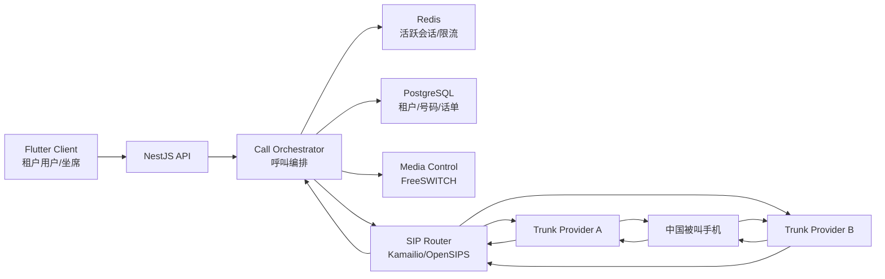
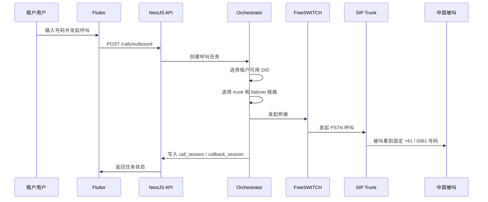
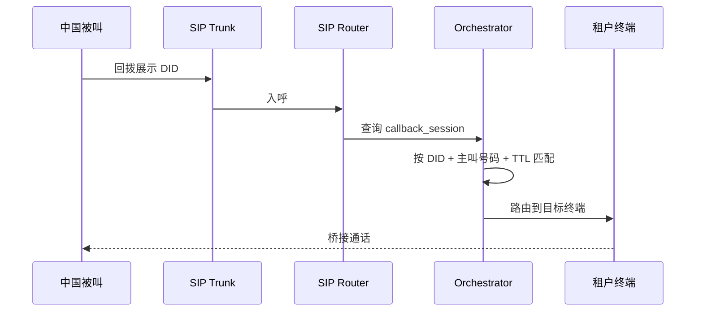

# 多租户境外号码语音平台设计方案

> 日期：2026-04-22
> 适用项目：`D:\no-ip-phone`
> 目标：在当前 Flutter + NestJS 项目基础上，演进为支持固定境外 DID 外显、回拨处理、多区号接入、多租户隔离的语音平台。

## 1. 背景与结论

当前项目已经具备以下基础：

- 客户端：Flutter，已经有登录、配置、拨号入口和本地历史能力。
- 服务端：NestJS + PostgreSQL + Redis + TypeORM，已经有账号、配置、后台管理能力。
- 当前拨号模式：客户端通过 `url_launcher` 调用系统拨号器，使用 `#31#` 这类 CLIR 前缀尝试隐藏主叫号码。

这意味着当前项目本质上仍是一个“前缀拨号器”，不是语音平台。  
而你现在要的能力是：

- 被叫侧看到固定境外号码，例如 `+61...` 或部分机型显示为 `0061...`
- 同一个展示号码支持回拨
- 后续可继续接入其他区号，例如 `+44`、`+1`
- 按租户隔离号码、线路、策略、账单和通话数据

所以本项目应从“CLIR 工具”升级为“多租户 DID 语音编排平台”。

## 2. 结合当前项目状态的判断

### 2.1 已有能力

- 统一账号体系已经存在，可作为租户成员体系的入口。
- `config` 模块已经有配置下发和后台配置入口，适合承接租户级语音策略配置。
- PostgreSQL + Redis 已经接入，足够支撑租户、号码、会话、回拨和限流模型。
- Flutter 端已经有拨号页、最近号码和配置拉取能力，可作为“发起语音任务”的 UI 壳。

### 2.2 当前不足

- 没有租户模型，所有账号、配置、数据都是平台级。
- 没有号码资源模型，只有“拨号前缀配置”。
- 没有语音域对象，例如 DID、线路、路由规则、会话、回拨会话、话单、录音。
- 没有实时呼叫控制层，客户端仍在直接调系统电话。
- 没有“入呼”处理能力，因此无法做真正的回拨路由。

### 2.3 演进原则

- 不推翻现有 NestJS/Flutter 架构。
- 将当前 `config` 和 `dialer` 能力保留为“兼容模式”。
- 新增独立语音域模块，逐步把拨号主流程从 `tel:` 调用迁移到服务端编排。
- 平台管理和租户管理分层，避免一开始把所有后台权限混在一起。

## 3. 目标能力范围

### 3.1 本次设计覆盖

- 多租户隔离
- 固定境外 DID 外显
- 同号回拨
- 多区号 DID 接入
- 多上游 trunk 容灾
- 账号、号码、策略、会话、录音、审计的基础模型
- 当前项目的模块拆分与迁移方案

### 3.2 明确不做

- 不设计“未知号码/匿名号码”伪装能力
- 不设计动态伪造主叫号
- 不把系统拨号器继续作为未来主流程

## 4. 目标架构

### 4.1 责任拆分

- Flutter Client：租户用户登录、号码输入、呼叫发起、最近呼叫、回拨状态查询。
- NestJS API：租户、账号、策略、号码分配、呼叫任务创建、回拨路由决策、后台管理。
- Call Orchestrator：平台核心，负责选 DID、选 trunk、写 session、处理 failover。
- SIP Router：负责和外部 trunk 互联，路由入呼/出呼。
- Media Control：负责桥接、振铃、录音、DTMF、超时、放音。
- PostgreSQL：持久化业务事实。
- Redis：活跃回拨会话、速率限制、幂等键、短期路由状态。

## 5. 多租户设计

### 5.1 租户边界

每个租户独立拥有：

- 成员与角色
- DID 号码池
- trunk 使用权限
- 出呼策略
- 回拨策略
- 通话记录与录音
- 限流与风控阈值

平台级资源由系统统一管理，再分配给租户：

- trunk provider
- 全局 DID 库存
- 国家和区号资源
- 媒体节点
- 审计与风控规则模板

### 5.2 建议角色

- `platform_admin`：平台管理员
- `tenant_owner`：租户拥有者
- `tenant_admin`：租户管理员
- `tenant_operator`：运营/客服
- `tenant_agent`：普通坐席或业务用户
- `tenant_auditor`：只读审计

当前项目里的 `app_user` / `admin` 两级角色不够，需要扩展成“平台角色 + 租户角色”双层模型。

## 6. 领域模型

### 6.1 核心实体

#### 平台域

- `tenants`
- `tenant_members`
- `trunk_providers`
- `trunk_endpoints`
- `media_nodes`
- `did_inventory`
- `country_resources`

#### 租户域

- `tenant_trunk_bindings`
- `tenant_number_pools`
- `tenant_did_assignments`
- `tenant_call_policies`
- `tenant_callback_policies`
- `tenant_endpoints`
- `tenant_webhooks`

#### 呼叫域

- `call_sessions`
- `call_legs`
- `callback_sessions`
- `call_events`
- `recordings`
- `billing_records`
- `audit_logs`

### 6.2 关键表建议

#### tenants

- `id`
- `code`
- `name`
- `status`
- `timezone`
- `default_country`
- `created_at`

#### tenant_members

- `id`
- `tenant_id`
- `account_id`
- `tenant_role`
- `status`

#### did_inventory

- `id`
- `provider_id`
- `phone_number_e164`
- `country_code`
- `area_code`
- `display_label`
- `capabilities`
- `status`
- `cost_monthly`

说明：

- `phone_number_e164` 存标准格式，例如 `+617676021983`
- UI 展示层可以派生 `0061...` 样式，但底层统一 E.164

#### tenant_did_assignments

- `id`
- `tenant_id`
- `did_id`
- `pool_id`
- `usage_mode`
- `callback_enabled`
- `status`

#### tenant_call_policies

- `id`
- `tenant_id`
- `default_did_strategy`
- `failover_strategy`
- `max_concurrent_calls`
- `max_call_duration_sec`
- `recording_enabled`
- `allowed_destinations`

#### tenant_endpoints

- `id`
- `tenant_id`
- `member_id`
- `endpoint_type`
- `endpoint_value`
- `priority`
- `status`

说明：

- `endpoint_type` 可为 `app_user`、`sip_extension`、`pstn_number`、`webhook`
- 这张表决定回拨回来的时候打给谁

#### call_sessions

- `id`
- `tenant_id`
- `direction`
- `from_endpoint_id`
- `to_number`
- `display_did_id`
- `selected_trunk_id`
- `status`
- `started_at`
- `answered_at`
- `ended_at`
- `hangup_cause`

#### callback_sessions

- `id`
- `tenant_id`
- `display_did_id`
- `remote_number`
- `origin_call_session_id`
- `target_endpoint_id`
- `status`
- `expires_at`

说明：

- 这张表是“同号回拨”的核心
- 被叫回拨 `display_did` 时，平台按 `display_did + remote_number` 命中最近可用 session

## 7. 呼叫流程设计

### 7.1 出呼流程

### 7.2 回拨流程

### 7.3 同号回拨规则

- 优先匹配最近一次有效外呼
- 必须命中同一个 `display_did`
- 必须命中相同 `remote_number`
- 必须在有效 TTL 内
- 若原终端离线，则按 `tenant_endpoint.priority` 顺序回退

建议 TTL：

- 高时效业务：30 分钟
- 一般业务：2 小时
- 宽松模式：24 小时

## 8. DID 与多区号策略

### 8.1 号码池模型

建议每个租户至少支持三种分配策略：

- `fixed_per_agent`：每个坐席固定一个 DID
- `fixed_per_customer_group`：客户分组固定 DID
- `shared_pool`：从共享池里挑选一个可用 DID

### 8.2 多区号接入

平台级维护 `country_resources`：

- `country_code`
- `country_name`
- `display_prefix`
- `regulatory_note`
- `enabled`

新增区号时，只需要：

1. 接入新的 trunk 或 DID 库存
2. 在 `country_resources` 开启该国家
3. 给租户配置可用号码池
4. 配置回拨 TTL 和路由策略

这样 `+61`、`+44`、`+1` 都走统一模型，不需要改业务主流程。

## 9. 对当前代码结构的改造建议

### 9.1 服务端模块重组

当前 `AppModule` 只导入了 `AuthModule`、`AdminModule`、`ConfigAppModule`。  
建议升级为：

- `AuthModule`
- `PlatformAdminModule`
- `TenantModule`
- `TenantMemberModule`
- `NumberInventoryModule`
- `TenantNumberPoolModule`
- `TrunkModule`
- `CallSessionModule`
- `CallbackModule`
- `RoutingModule`
- `BillingModule`
- `ConfigModule`

### 9.2 当前模块如何复用

#### auth / account

保留，但新增：

- `tenant_members`
- 登录上下文里的 `tenant_id`
- 平台角色和租户角色解析

#### config

从“拨号前缀配置”升级为“两层配置”：

- 平台配置：全局 trunk、国家资源、媒体节点模板
- 租户配置：号码池、回拨 TTL、录音策略、并发限制

#### admin

拆成两个层面：

- 平台后台：看所有租户、所有 trunk、全局 DID 库存
- 租户后台：只看自己租户的数据和策略

### 9.3 客户端改造

当前 `dial_service.dart` 是 `tel:` 拉起系统电话。  
目标改造为：

- `DialService` 保留接口，但新增实现 `ServerOrchestratedDialService`
- 发起呼叫时先请求后端创建呼叫任务
- 客户端不再依赖 `#31#`
- 首页仍可保留“最近号码”和“一键再拨”
- 新增“当前展示号”“回拨有效期”“呼叫状态”提示

建议保留当前 `UrlLauncherDialService` 作为兼容模式：

- `direct_prefix_mode`
- `server_orchestrated_mode`

这样迁移期间不需要一次性切断旧流程。

## 10. API 设计建议

### 10.1 租户管理

- `POST /platform/tenants`
- `GET /platform/tenants`
- `GET /tenant/profile`
- `POST /tenant/members`

### 10.2 号码与线路

- `GET /tenant/dids`
- `POST /tenant/number-pools`
- `POST /tenant/number-assignments`
- `GET /platform/trunks`
- `POST /platform/did-inventory/import`

### 10.3 呼叫与回拨

- `POST /calls/outbound`
- `GET /calls/:id`
- `GET /calls/recent`
- `GET /callbacks/active`
- `POST /callbacks/:id/expire`

### 10.4 Webhook

- `POST /webhooks/call-status`
- `POST /webhooks/inbound-call`
- `POST /webhooks/recording-ready`

## 11. 数据隔离与安全

### 11.1 多租户隔离策略

推荐采用“共享库、行级隔离”的第一阶段方案：

- 所有核心业务表都有 `tenant_id`
- Repository 层统一注入 `tenant_id` 过滤
- 平台管理员接口显式绕过租户过滤

原因：

- 当前项目已在单库单实例上运行
- 对现有 TypeORM 侵入相对可控
- 早期租户规模不大时，运维简单

后续若租户量增长，再考虑：

- 按租户分 schema
- 或者大客户独立库

### 11.2 审计要求

必须新增：

- `audit_logs`
- `call_events`
- `billing_records`

至少记录：

- 谁分配了哪个 DID
- 哪个租户改了 trunk 策略
- 哪次外呼选用了哪个展示号
- 哪次回拨命中了哪个 callback session

## 12. 实施路线图

### Phase 0：保持现状可运行

- 保留 CLIR 模式
- 不动当前 Flutter 主流程
- 开始新增多租户基础表

### Phase 1：引入多租户基础模型

- 新增 `tenants` / `tenant_members`
- 扩展 `accounts` 与角色模型
- 改造后台为平台后台 + 租户后台

### Phase 2：接入 DID 与 trunk

- 新增 DID 库存、租户号码池、trunk 绑定
- 后端可创建“逻辑外呼任务”

### Phase 3：引入呼叫编排

- 上 FreeSWITCH + Kamailio/OpenSIPS
- 打通外呼展示固定 DID
- 写入 `call_sessions`

### Phase 4：实现回拨

- 新增 `callback_sessions`
- 完成同号回拨命中和桥接
- 支持终端离线回退

### Phase 5：多区号与计费

- 加入 `+44`、`+1` 等新号码池
- 引入租户级账单与报表

## 13. 最终建议

结合当前项目状态，最合理的做法不是继续把“隐私拨打”做深，而是：

1. 把当前项目定义为“客户端壳 + 租户控制台 + 编排 API”
2. 新增语音平台域，而不是把 DID/trunk/session 塞进原来的 `config` 表里
3. 客户端逐步从 `tel:` 直拨迁移到“服务端发起语音任务”
4. 多租户从第一天就建模，否则后面号码、账单、录音都会很难拆

一句话总结：

当前代码可以继续当基础，但目标系统已经不是“隐私拨号 App”，而是“多租户境外 DID 语音平台”。
