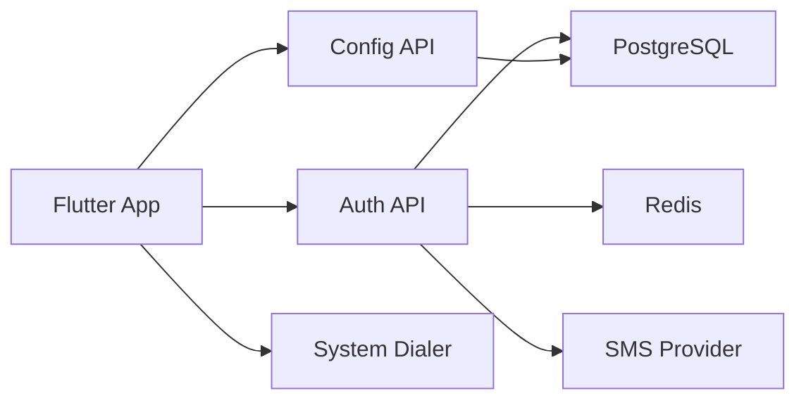
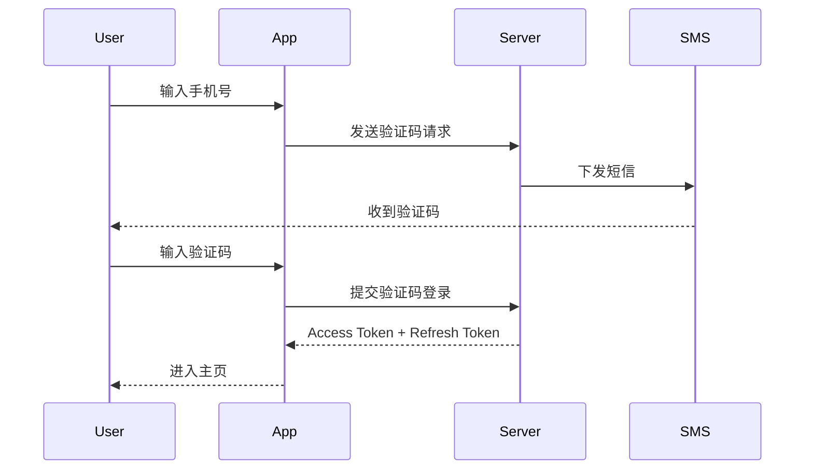

# 隐私拨号 App 设计文档

## 1. 文档目的

本文档用于指导一款“隐私拨号”移动应用的设计与实施。应用目标是：

- 支持 Android 与 iOS 双平台。
- 用户必须先登录，登录成功后才能使用拨号功能。
- 在用户发起拨号时，尽可能隐藏对方所见的来电号码与地区信息。
- 在不接入云通信中继、不改造真实手机号的前提下，基于系统电话能力完成拨号。

本文档给出产品边界、技术架构、关键流程、权限配置、接口设计、风险与验收标准，作为研发、测试和上线评审依据。

## 2. 设计结论摘要

### 2.1 核心结论

本方案可以实现“登录后才能使用的跨平台隐私拨号 App”，但必须明确以下事实：

1. App 本身无法在电信网络层强制隐藏真实号码。
2. App 能做的是在拨号前拼接运营商前缀，例如 `#31#`，并唤起系统电话 App 发起呼叫。
3. 是否最终向被叫侧隐藏号码或地区信息，取决于运营商、地区、SIM 卡、系统拨号器和网络环境。
4. 如果用户所在运营商或地区不支持来电号码隐藏，仅靠 App 无法保证实现目标。
5. 如果业务要求“稳定、可控、100% 隐藏真实号码与地区”，则必须改为云通信中继、虚拟号或呼叫转接方案，不属于本文档范围。

### 2.2 推荐落地路线

为兼顾可实施性与用户体验，推荐采用以下方案：

- 客户端：Flutter
- 登录体系：手机号验证码登录
- 鉴权架构：自建后端 + JWT + 刷新令牌
- 短信服务：接入国内短信供应商
- 拨号实现：`url_launcher` 调起系统 `tel:` 拨号
- 隐私拨号策略：默认拼接 `#31#`，并支持在设置中切换其他前缀
- 兼容策略：支持普通拨打回退、运营商兼容性提示、真机验证矩阵

不将 Firebase Phone Auth 作为本方案默认实现，原因是本项目目标用户更可能处于中国大陆移动网络环境，短信可达性、计费与合规控制更适合由业务侧自行掌握。

## 3. 产品目标与边界

### 3.1 产品目标

- 为已登录用户提供简单、直接的拨号入口。
- 允许用户输入手机号并一键发起“隐私拨打”。
- 在支持的网络环境中，让被叫侧看到“未知号码”“私人号码”“限制号码”或类似表现。
- 提供普通拨打作为回退路径。
- 提供前缀配置、说明提示和兼容性引导。

### 3.2 非目标

- 不提供互联网语音通话。
- 不提供虚拟号、中继号、号码池。
- 不承诺在所有运营商、所有地区、所有终端上都能隐藏号码或地区信息。
- 不绕过系统电话 App 在 iOS 和 Android 的安全限制。
- 不默认上传用户拨号历史到服务端。

## 4. 用户角色与核心场景

### 4.1 用户角色

- 未登录用户：只能访问登录页、协议页、帮助页。
- 已登录用户：可访问主页、拨号、设置、帮助。
- 管理员：通过后台管理前缀配置、运营商兼容提示、公告与风控规则。

### 4.2 核心使用场景

#### 场景一：首次使用

1. 用户打开 App。
2. App 检测本地无有效登录态。
3. 跳转登录页。
4. 用户输入手机号并获取短信验证码。
5. 验证通过后获取访问令牌。
6. 进入主页后才能使用拨号功能。

#### 场景二：隐私拨打

1. 用户在主页输入目标号码。
2. App 对号码进行清洗和校验。
3. App 读取当前隐私前缀配置，例如 `#31#`。
4. App 生成拨号串并调起系统电话 App。
5. 用户在系统拨号界面确认并发起通话。
6. 若运营商支持，则被叫侧可能显示未知号码或私人号码。

#### 场景三：运营商不支持

1. 用户多次测试后发现被叫侧仍能看到号码或地区。
2. App 提示当前网络可能不支持来电隐藏。
3. App 提供普通拨打、切换前缀、查看帮助说明等回退措施。

## 5. 功能需求

### 5.1 账号与登录

- 支持手机号验证码登录。
- 登录成功后才允许进入拨号主页。
- 支持自动续期登录态。
- 支持退出登录。
- 支持单设备或多设备登录策略配置。
- 支持服务端封禁账户。

### 5.2 拨号功能

- 支持输入中国大陆手机号、座机号及国际号码。
- 支持普通拨打。
- 支持隐私拨打。
- 支持默认前缀配置。
- 支持用户手动切换隐私前缀。
- 支持最近号码记录，仅本地保存。

### 5.3 帮助与提示

- 首次使用时展示“功能受运营商支持情况影响”的说明。
- 在隐私拨打前弹出风险提示，可勾选“不再提示”。
- 提供常见问题页，解释为何某些号码无法隐藏。
- 提供合法合规使用提示。

### 5.4 配置与后台

- 后台可配置不同国家或地区的默认隐私前缀。
- 后台可配置公告、兼容性提示文案、版本开关。
- 后台可按用户、设备、IP、手机号频次做风控限制。

## 6. 非功能需求

### 6.1 性能

- 冷启动时间不超过 2 秒。
- 登录成功进入主页时间不超过 1 秒。
- 本地号码格式化和拨号串生成响应时间不超过 100 毫秒。

### 6.2 安全

- 访问令牌存储在安全存储区。
- 刷新令牌支持轮换与失效。
- 验证码接口必须限流。
- 服务端日志中脱敏手机号。

### 6.3 可用性

- Android 10+ 可用。
- iOS 15+ 可用。
- 弱网下登录流程可提示重试。
- 用户未登录时，任何拨号页面不可直达。

### 6.4 合规

- 首次登录前需同意用户协议与隐私政策。
- 明确提示本应用仅用于合法隐私保护场景。
- 不误导用户认为本应用可以绕过运营商限制。

## 7. 技术方案总览

### 7.1 架构图



### 7.2 模块划分

客户端模块：

- 启动与路由模块
- 登录模块
- 会话管理模块
- 拨号模块
- 本地配置模块
- 帮助与说明模块

服务端模块：

- 认证服务
- 短信验证码服务
- 用户服务
- 配置服务
- 风控服务
- 管理后台

## 8. 技术选型

### 8.1 客户端

- Flutter 3.x
- Dart 3.x
- 状态管理：Riverpod
- 路由：go_router
- 网络库：Dio
- 本地安全存储：flutter_secure_storage
- 本地轻量配置：shared_preferences
- 系统拨号：url_launcher
- 埋点与崩溃：Sentry 或 Firebase Crashlytics

### 8.2 服务端

- 框架：NestJS
- 数据库：PostgreSQL
- 缓存与限流：Redis
- 认证：JWT Access Token + Refresh Token
- 短信服务：阿里云短信、腾讯云短信或其他合规供应商
- 管理后台：NestJS Admin 或独立 Web 控制台

### 8.3 选择理由

- Flutter 能同时覆盖 Android 与 iOS，适合单团队快速交付。
- 自建认证链路比 Firebase Phone Auth 更适合控制短信供应商、合规、风控与成本。
- `url_launcher` 足以完成系统电话 App 调起，不需要自行实现底层电话能力。

## 9. 关键能力边界

### 9.1 能做的事情

- 拼接隐私前缀，例如 `#31#13800138000`。
- 调起系统拨号器或电话 App。
- 在拨号前做登录校验、号码校验、前缀选择和风险提示。
- 根据地区或运营商展示不同说明文案。

### 9.2 不能保证的事情

- 不能保证所有运营商都支持 `#31#`。
- 不能保证所有系统拨号器都以相同方式处理 `#` 前缀。
- 不能保证被叫侧一定显示“未知号码”。
- 不能保证只隐藏地区而保留号码本身；多数情况下隐藏的是完整 Caller ID。

### 9.3 对外表述建议

产品对外不得宣传为“100% 隐藏地区信息”或“必然隐藏真实号码”，应统一表述为：

“应用会在支持的设备和运营商网络上尝试隐藏来电显示；实际效果取决于运营商、地区和终端环境。”

## 10. 登录与鉴权设计

### 10.1 登录方式

推荐主登录方式：

- 手机号 + 短信验证码登录

可扩展登录方式：

- Apple 登录
- Google 登录
- 邮箱密码登录

MVP 阶段只实现手机号验证码登录即可。

### 10.2 鉴权流程



### 10.3 Token 设计

- Access Token：有效期 2 小时
- Refresh Token：有效期 30 天
- 刷新令牌存储在安全存储区
- 每次刷新后轮换 Refresh Token
- 退出登录时服务端注销当前 Refresh Token

### 10.4 登录态控制

- App 启动时先校验本地 Access Token 是否有效。
- 若已过期则尝试刷新。
- 刷新失败则回到登录页。
- 所有拨号入口必须经过登录态守卫。

### 10.5 服务端接口

认证接口：

- `POST /api/v1/auth/send-code`
- `POST /api/v1/auth/login`
- `POST /api/v1/auth/refresh`
- `POST /api/v1/auth/logout`
- `GET /api/v1/auth/me`

配置接口：

- `GET /api/v1/config/dial-prefixes`
- `GET /api/v1/config/notices`

### 10.6 风控设计

- 同一手机号 60 秒内最多发送 1 次验证码。
- 同一手机号 1 小时内最多发送 5 次验证码。
- 同一 IP 1 小时内设置发送上限。
- 验证码连续输错超过阈值后临时锁定。

## 11. 隐私拨号设计

### 11.1 号码处理流程

1. 用户输入目标号码。
2. App 去除空格、横杠等无关字符。
3. App 校验号码格式。
4. App 读取当前用户默认隐私前缀。
5. App 组合拨号串。
6. App 调起系统电话 App。

### 11.2 拨号串生成规则

默认规则：

- 普通拨打：`13800138000`
- 隐私拨打：`#31#13800138000`

可扩展规则：

- 根据国家或地区切换前缀
- 根据运营商切换前缀
- 允许后台禁用失效前缀

### 11.3 客户端伪代码

```dart
Future<void> startPrivateCall(String rawNumber, String prefix) async {
  final normalized = normalizePhoneNumber(rawNumber);
  if (!isValidPhoneNumber(normalized)) {
    throw Exception('invalid phone number');
  }

  final dialString = '$prefix$normalized';
  final uri = Uri(scheme: 'tel', path: dialString);
  final launched = await launchUrl(uri, mode: LaunchMode.externalApplication);

  if (!launched) {
    throw Exception('unable to launch dialer');
  }
}
```

### 11.4 Android 设计要点

- MVP 推荐使用系统拨号器确认呼出，而不是直接静默拨打。
- 优先采用系统拨号界面方案，对权限要求更低。
- 若仅调起拨号器，一般不需要 `CALL_PHONE` 运行时权限。
- Android 11+ 若使用查询能力，应补充 `tel` scheme 相关配置。

### 11.5 iOS 设计要点

- iOS 只能通过系统能力调起电话 App。
- iOS 不允许应用静默发起真实电话。
- 某些设备与运营商组合下，`#31#` 可能有效，也可能被系统或运营商忽略。
- 如果运营商支持系统层面的 Caller ID 开关，可在帮助页引导用户手动前往系统设置，但 App 不应承诺可自动控制该开关。

### 11.6 失败与回退策略

- 调起失败：提示用户检查系统电话能力是否可用。
- 隐私前缀疑似无效：建议用户切换前缀或使用普通拨打。
- 多次测试无效：提示当前运营商或地区可能不支持隐藏来电显示。

## 12. 页面与交互设计

### 12.1 页面清单

- 启动页
- 登录页
- 验证码页
- 主页
- 设置页
- 帮助页
- 关于页

### 12.2 页面说明

启动页：

- 检查登录态
- 拉取远程配置
- 决定跳转登录页或主页

登录页：

- 手机号输入框
- 获取验证码按钮
- 用户协议和隐私政策勾选项

验证码页：

- 验证码输入框
- 倒计时
- 重发按钮

主页：

- 号码输入框
- 普通拨打按钮
- 隐私拨打按钮
- 最近号码列表

设置页：

- 默认隐私前缀
- 隐私拨打提示开关
- 清除本地历史
- 退出登录

帮助页：

- 能力边界说明
- 常见问题
- 兼容性说明

## 13. 本地数据设计

### 13.1 本地存储内容

- Access Token
- Refresh Token
- 用户基本信息
- 默认隐私前缀
- 是否已阅读提示
- 最近拨打号码

### 13.2 存储要求

- Token 必须使用安全存储。
- 最近号码可用 `shared_preferences` 或本地数据库。
- 不在明文日志中打印手机号和验证码。

## 14. 服务端数据模型

### 14.1 users

- `id`
- `phone`
- `status`
- `created_at`
- `last_login_at`

### 14.2 auth_codes

- `id`
- `phone`
- `code_hash`
- `expired_at`
- `used_at`
- `send_ip`

### 14.3 refresh_tokens

- `id`
- `user_id`
- `token_hash`
- `device_id`
- `expired_at`
- `revoked_at`

### 14.4 dial_prefix_configs

- `id`
- `country_code`
- `carrier_name`
- `prefix`
- `status`
- `remark`

## 15. 权限与平台配置

### 15.1 Android

基础权限：

- `INTERNET`

可选配置：

- `queries` 中声明 `tel` scheme，用于部分系统对外部应用查询能力的限制场景

MVP 不默认申请：

- `CALL_PHONE`

理由：

- 当前方案是拉起系统拨号器，由用户在系统界面确认拨打。
- 直接拨打权限会增加审核与权限弹窗成本，不是 MVP 必需。

### 15.2 iOS

可选配置：

- 在使用 scheme 查询时补充 `LSApplicationQueriesSchemes`

注意事项：

- iOS 真实电话呼叫最终由系统电话 App 完成。
- App Store 审核时需确保描述真实，不得宣称具备系统不允许的静默呼叫能力。

## 16. 安全与隐私设计

- 用户手机号按最小必要原则存储与处理。
- 验证码只保存哈希，不保存明文。
- 日志、埋点、错误上报统一脱敏。
- 默认不上传拨号历史。
- 若将来要做云同步，必须单独征得用户同意。

## 17. 监控与运营

### 17.1 关键指标

- 登录成功率
- 短信发送成功率
- 验证码校验成功率
- 拨号按钮点击率
- 调起系统拨号器成功率
- 用户反馈的“隐私拨打有效率”

### 17.2 错误监控

- 验证码发送失败
- Token 刷新失败
- `tel:` 调起失败
- 配置拉取失败

## 18. 测试方案

### 18.1 功能测试

- 未登录不可使用拨号
- 登录成功后可进入主页
- 普通拨打可正常调起系统电话
- 隐私拨打可正常拼接前缀
- 设置项保存后重启仍生效

### 18.2 兼容性测试

测试维度：

- Android / iOS
- 不同机型
- 不同系统版本
- 不同运营商
- 不同地区
- 不同隐私前缀

### 18.3 验收标准

产品验收应基于以下标准：

1. 未登录状态下无法进入拨号主页。
2. 登录成功后，主页和设置页可正常访问。
3. 输入合法号码后，普通拨打和隐私拨打都能成功拉起系统电话 App。
4. 在“支持 Caller ID 隐藏”的运营商环境中，隐私拨打具备较高成功率。
5. 在“不支持 Caller ID 隐藏”的环境中，App 能正确提示并提供回退方案。

## 19. 风险清单

### 19.1 高风险

- 运营商不支持 `#31#` 或类似前缀。
- 某些系统拨号器对带 `#` 的 `tel:` 处理不一致。
- 用户误解产品能力，认为 App 可以 100% 隐藏号码或地区。

### 19.2 中风险

- 短信服务可达性、成本与风控压力。
- iOS 与 Android 不同机型对拨号串处理差异较大。
- 海外号码与国际格式适配增加复杂度。

### 19.3 应对措施

- 上线前完成运营商和机型矩阵验证。
- 产品内强提示能力边界。
- 后台可动态调整前缀与文案。
- 始终保留普通拨打回退。

## 20. 分阶段实施计划

### 阶段一：MVP

- 手机号验证码登录
- 登录态守卫
- 普通拨打
- 隐私拨打
- 前缀设置
- 帮助说明页

### 阶段二：增强版

- 最近号码
- 后台前缀配置
- 用户反馈收集
- 登录风控增强

### 阶段三：运营版

- 多登录方式
- 后台管理平台
- 更精细的兼容性提示
- 数据分析与运营配置

## 21. 最终建议

该项目可以实施，但应以“尝试隐藏来电显示”的产品定位推进，而不是以“必然隐藏地区信息”作为承诺。

推荐按照以下原则执行：

1. 客户端使用 Flutter 实现 Android 与 iOS 双端统一开发。
2. 账号体系使用自建短信验证码登录，确保登录后才能使用。
3. 拨号能力基于系统电话 App 实现，不追求静默直拨。
4. 将运营商兼容性验证作为上线前的硬门槛。
5. 在文案、帮助和协议中明确能力边界，避免误导。

如果后续业务要求升级为“稳定隐藏真实号码与地区”，则应立项为新的通信架构方案，采用虚拟号或中继呼叫模式重新设计。
